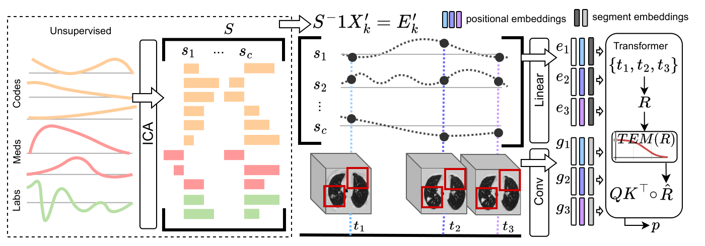

# lmsignatures
Longitudinal multimodal transformer integrating imaging and latent clinical
signatures from routine ehrs for pulmonary nodule classification. https://doi.org/10.48550/arXiv.2304.02836

Please cite the preprint if you find this helpful. Disclaimer: this repo is in development and has not been packaged or robustly documented. 



## Data prep
### Imaging
We use the [pipeline from Liao et al [1]]( https://github.com/lfz/DSB2017). to preprocess CT scans and propose ROIs for detected nodules. 

Save preprocessed scans as `id_clean.npy` and save proposed ROIs as `id_pbb.npy`, where `id` is the session level unique identifier (UID). 

### Latent clinical signatures approach
Pipeline for inferring latent clinical signatures: https://github.com/ComputationalMedicineLab/cml_data_tools
- uses the [fast_intensity](https://github.com/ComputationalMedicineLab/fast_intensity) libary to transform episodic data to longitudinal intensity curves
- we use [sklearn.decomposition.FastICA](https://scikit-learn.org/stable/modules/generated/sklearn.decomposition.FastICA.html) as our ICA algorithm
  
Input tabular file should be a csv with headers (in order):
| pid | id | session | shifted_scan_date | Duration | lung_cancer | exp-000 | exp-001 | .... | exp-NNNN |
| ------| ------ | -----------| ----------- | ----------- | ------ | ------ | ------ | ------ | ------ |
| subject level UID | session level UID | order of the CT session within a subject (i.e. 0,1,2,etc) | session acquisition date YYYY-mm-dd | days between this session and the subject's latest session | binary class label | expression of signature 1 | expression of signature 2 | ... | expression of last signature


### Code2vec approach
Requires 3 input files: tabular file as shown above (signatures not needed), ICD codes, and [ICD10 embedding from Finch et al [2]](https://doi.org/10.5061/dryad.v9s4mw6v0)

The ICD codes is a csv in the structure of: 
| pid | ICD_CODE |
| ------| ------ | 
| subject level UID | ICD9 or ICD10 code |

A copy of the ICD9 to ICD10 dictionary from https://github.com/bhanratt/ICD9CMtoICD10CM is provided for convenience in this repo. This is used to convert all codes to ICD10 internally. 

## Usage
```
pip install -r requirements.txt
```
Entry point to running experiments:
```
python3 main.py --config [CONFIG_FILE]
    --single_train  single phase training
    --single_test   single phase test
    --cv_train      cross validation training
    --cv_test       test using cross validation folds. use the same random seed as cv_train phase
    --folds         number of cross validation folds
```
Example of pretraining on imaging only data and finetuning on multimodal data with clinical signature approach:
```
python3 main.py --config tdsig_nlst --single_train
python3 main.py --config tdsig_imageehr --cv_train --folds 5
python3 main.py --config tdsig_imageehr --cv_test --folds 5
```

## Cite
Li, T.Z., Still, J.M., Xu, K., Lee, H.H., Cai, L.Y., Krishnan, A.R., Gao, R., Khan,
M.S., Antic, S., Kammer, M., Sandler, K.L., Maldonado, F., Landman, B.A., Lasko,
T.A.: Longitudinal multimodal transformer integrating imaging and latent clinical
signatures from routine ehrs for pulmonary nodule classification. arXiv preprint
arXiv:2304.02836 (2023) 
```
@article{litz2023lm,
    Author = {Thomas Z. Li and John M. Still and Kaiwen Xu and Ho Hin Lee and Leon Y. Cai and Aravind R. Krishnan and Riqiang Gao and Mirza S. Khan and Sanja Antic and Michael Kammer and Kim L. Sandler and Fabien Maldonado and Bennett A. Landman and Thomas A. Lasko},
    Title = {Longitudinal Multimodal Transformer Integrating Imaging and Latent Clinical Signatures From Routine EHRs for Pulmonary Nodule Classification},
    Year = {2023},
    Journal={arXiv preprint arXiv:2304.02836},
}
```

## References
1. Liao, F., Liang, M., Li, Z., Hu, X., Song, S.: Evaluate the malignancy of pulmonary
nodules using the 3-d deep leaky noisy-or network. IEEE transactions on neural
networks and learning systems 30(11), 3484–3495 (2019)
2. Finch, A., Crowell, A., Bhatia, M., Parameshwarappa, P., Chang, Y.C., Martinez,
J., Horberg, M.: Exploiting hierarchy in medical concept embedding. JAMIA open
4(1). (2021)